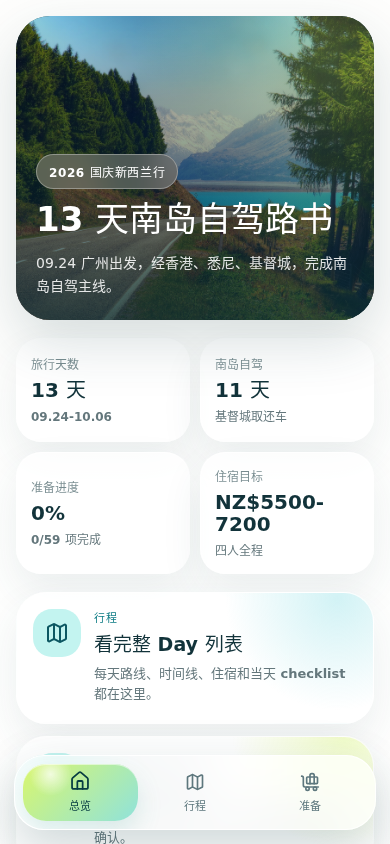
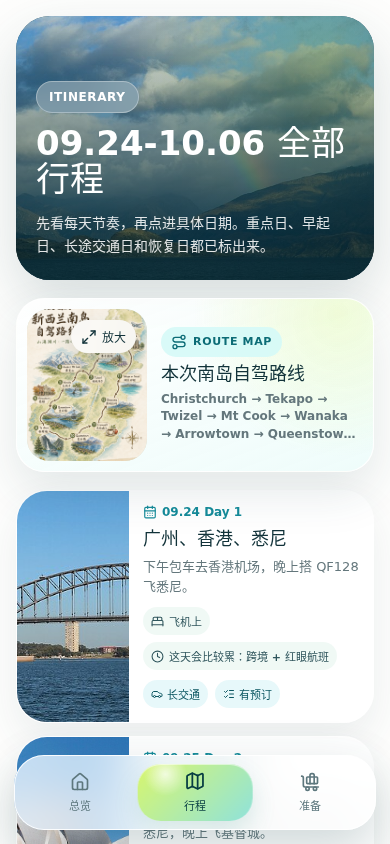
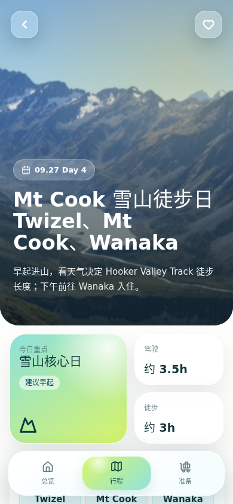
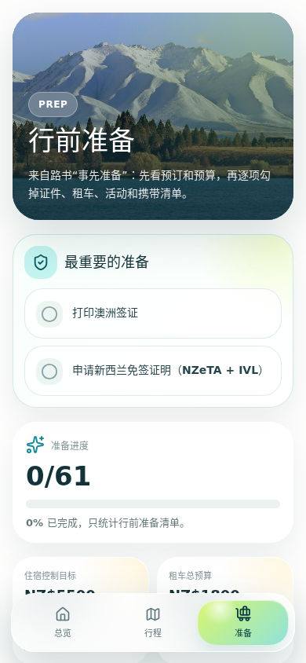

# NewZealand Trip Planner

一个面向 2026 国庆新西兰同行人的移动端旅行路书 App。它把原始行程、住宿/租车/活动预算、每日时间线、行前准备清单和地点说明整理成一个手机优先的静态 Web 应用，并可以同时打包为 Capacitor Android App。

线上地址：<https://newzealand.castaly.site>

## 截图

以下截图来自生产构建预览，视口为 `390x844`。

<table>
  <tr>
    <td></td>
    <td></td>
    <td></td>
    <td></td>
  </tr>
  <tr>
    <td>总览</td>
    <td>行程</td>
    <td>Day 详情</td>
    <td>准备</td>
  </tr>
</table>

## 项目定位

这个项目不是通用旅游攻略站，也不是 Markdown 渲染器。它是一个给具体同行人使用的旅行执行工具：

- 出发前：确认签证、住宿、租车、活动、现金、保险和携带清单。
- 讨论时：用图片、路线图、地点卡片和当天方案帮助同行人做选择。
- 旅途中：快速查看今天几点去哪、开多久、住哪里、当天必须确认什么。
- 临时调整时：查看天气备选、驾驶提醒、复查事项和官方链接。

当前实现是纯前端静态应用，没有后端、账号系统或远程同步。所有勾选状态、收藏和方案选择都保存在浏览器 `localStorage`。

## 行程范围

行程覆盖 `2026-09-24` 到 `2026-10-06`，共 13 天：

| Day | 日期 | 主线 |
|---|---:|---|
| 1 | 09.24 | 广州 -> 香港 -> 悉尼，包车到 HKG，QF128 红眼飞悉尼 |
| 2 | 09.25 | 悉尼入境中转短游，晚上飞基督城 |
| 3 | 09.26 | 基督城取车采购，经 Tekapo 到 Twizel |
| 4 | 09.27 | Twizel -> Mt Cook -> Wanaka，Hooker Valley Track 天气决策日 |
| 5 | 09.28 | Wanaka 湖边恢复、洗衣、补给 |
| 6 | 09.29 | Wanaka -> Arrowtown -> Queenstown |
| 7 | 09.30 | Queenstown 自由活动选择日 |
| 8 | 10.01 | Queenstown -> Te Anau，Milford 前夜基地 |
| 9 | 10.02 | Milford Sound Te Anau 出发大巴 + 游船一日团 |
| 10 | 10.03 | Te Anau -> Queenstown，峡湾后缓冲 |
| 11 | 10.04 | Queenstown -> Cromwell / Omarama -> Twizel / Tekapo |
| 12 | 10.05 | Mackenzie 湖区返回基督城机场附近 |
| 13 | 10.06 | 基督城还车，经墨尔本回香港 |

## 核心功能

### 总览

入口：`/#overview`

- 展示旅行天数、南岛自驾天数、准备完成度和住宿预算目标。
- 提供进入完整行程和行前准备的主入口。
- 使用 Lake Pukaki / Mt Cook 视觉作为整趟路线的主题信号。

### 行程列表

入口：`/#trip`

- 按 Day 1 到 Day 13 展示日期、城市、摘要、住宿、强度和状态标签。
- 标出早起、长交通、自由/恢复、必订项目等执行特征。
- 内置南岛自驾路线图，支持放大查看。
- 点击任意日期进入对应 Day 详情，例如 `/#day-4`。

### Day 详情

入口：`/#day-1` 到 `/#day-13`

每一天包含：

- 顶部大图、日期、标题、当天摘要和收藏按钮。
- 今日重点、驾驶/徒步/飞行指标、动线节点。
- 重要提醒和核心看点。
- 三个内容面板：
  - `出发前确认`：当天 checklist、临近复查、官方链接。
  - `今天怎么走`：时间线、交通/活动节点、天气或方案切换、住宿备注。
  - `当地特色`：餐饮、景点、项目、默认推荐和备选链接。
- 下一站卡片，便于连续浏览路线。

### 上下文卡片

很多时间线节点和核心看点可以打开详情弹窗。弹窗支持：

- 图片轮播和缩略图。
- `速览 / 了解 / 规则 / 拍照` 分页。
- 中文解释、quick facts、标签、习俗/规则提醒、拍照建议。
- 官方链接或参考链接外跳。

数据来自 `src/data/tripData.ts` 的 `contextCards`。

### 行前准备

入口：`/#todos`

- 汇总最关键准备事项：澳洲签证、新西兰 NZeTA + IVL。
- 统计行前准备总进度。
- 按类别组织 checklist：
  - 住宿预订
  - 汽车 / 租车
  - 路况 / 驾驶
  - 现金 / 支付
  - 餐厅 / 订位
  - 景点 / 活动
  - 签证 / 证件 / 保险
  - 携带物品
- 每个任务可附带截止日期、预算金额、关联 Day 和优先级。

## 技术栈

| 层 | 说明 |
|---|---|
| UI | React 19 + TypeScript |
| 构建 | Vite 8 |
| 图标 | `lucide-react` |
| 状态 | React state + `localStorage` |
| 路由 | `window.location.hash`，无需服务端 fallback |
| 移动端包装 | Capacitor 8 + Android project |
| 部署 | Cloudflare Pages + `newzealand.castaly.site` custom domain |

## 目录结构

| 路径 | 用途 |
|---|---|
| `src/App.tsx` | 应用入口、hash 路由、全局状态和 localStorage 写入 |
| `src/pages/OverviewPage.tsx` | 总览页 |
| `src/pages/ItineraryListPage.tsx` | Day 列表和路线图入口 |
| `src/pages/DayDetailPage.tsx` | 每日路书详情 |
| `src/pages/PrepPage.tsx` | 行前准备 checklist |
| `src/components/ContextModal.tsx` | 地点、交通、航班、餐饮等上下文弹窗 |
| `src/components/RouteMapCard.tsx` | 南岛自驾路线图 |
| `src/data/tripData.ts` | 主要行程、上下文卡片、预算、行前任务数据 |
| `src/types/trip.ts` | 路书数据结构类型 |
| `src/content/itinerary.md` | 原始路书内容存档 |
| `public/trip-media/` | 新西兰主题图片和路线图 |
| `public/itinerary-media/` | 原始路书图片 |
| `docs/design-guidelines.md` | 产品/视觉设计方向 |
| `docs/readme/` | README 截图 |
| `scripts/deploy-cloudflare.sh` | Cloudflare Pages 一键发布脚本 |
| `android/` | Capacitor Android 项目 |

## 数据维护

### 修改行程

主要改 `src/data/tripData.ts`：

- `tripDays`：Day 1 到 Day 13 的标题、日期、路线、时间线、住宿、提醒、每日 checklist。
- `contextCards`：地点、航班、交通、餐饮、活动等弹窗资料。
- `todoGroups`：行前准备分组和任务。
- `prepBudgetCards` / `budgetCards`：预算摘要。

类型定义在 `src/types/trip.ts`。新增字段前先确认页面是否消费该字段；不要只往数据里堆未使用内容。

### 修改图片

公共图片放在 `public/` 下，代码中用根路径引用，例如：

```ts
const routeMapImage = '/trip-media/south-island-route-map.png'
```

新图片需要同步更新来源说明，尤其是 `public/trip-media/README.md`。如果替换路线图，也要检查 `RouteMapCard` 和 README 截图是否需要重截。

### 修改进度状态

当前状态 key：

```ts
newzealand-trip:app-state:v2
```

状态包括：

- `completedTodoIds`
- `completedDayTodos`
- `likedDays`
- `selectedPlans`

如果改动状态结构，需要考虑是否升级 key，避免旧浏览器缓存和新结构冲突。

## 本地开发

安装依赖：

```bash
npm ci
```

启动开发服务：

```bash
npm run dev
```

生产构建：

```bash
npm run build
```

本地预览生产产物：

```bash
npm run preview
```

代码检查：

```bash
npm run lint
```

## Cloudflare 发布

正式域名：<https://newzealand.castaly.site>

推荐直接使用一键脚本：

```bash
npm run deploy:cloudflare
```

脚本会执行：

1. 检查依赖，必要时运行 `npm ci`。
2. 运行 `npm run build`。
3. 用 Wrangler 将 `dist/` 发布到 Cloudflare Pages project `newzealand`。
4. 确认 Pages custom domain `newzealand.castaly.site`。
5. 确认 DNS CNAME `newzealand.castaly.site -> newzealand-e82.pages.dev`。
6. 确认 `newzealand.castaly.site/*` 是 disabled Worker route，避免被 `*.castaly.site/*` 的 Castaly publish dispatch 接管。
7. 访问正式域名并验证 HTML、JS、CSS 都可用。

Cloudflare credential 默认从以下文件读取：

```text
/root/castaly/.runtime/secrets/cloudflare-api-token.env
```

不要把 token 值写进 README、AGENTS、脚本、commit message 或终端输出。

如果只想手动发布静态文件：

```bash
npm run build
npx wrangler pages deploy dist --project-name newzealand --branch main --commit-dirty=true
```

手动发布不会自动修复 custom domain、DNS 和 Worker route，正常维护请优先使用 `npm run deploy:cloudflare`。

## Android 打包

项目保留了 Capacitor Android 包装。Web 产物目录是 `dist`，配置见 `capacitor.config.ts`。

同步 Android 工程：

```bash
npm run android:sync
```

打开 Android Studio：

```bash
npm run android:open
```

构建 APK：

```bash
npm run android:apk
```

Android 包装只消费同一套 Vite 静态产物。改 Web UI 后先确认 `npm run build` 通过，再同步 Android。

## 更新 README 截图

README 截图保存在 `docs/readme/`。推荐用生产构建预览截图：

```bash
npm run build
npm run preview -- --host 127.0.0.1 --port 4173
```

如果 4173 被占用，Vite 会自动换端口。以下命令以 `4174` 为例：

```bash
npx playwright screenshot --viewport-size=390,844 --wait-for-timeout=1200 'http://127.0.0.1:4174/#overview' docs/readme/overview.png
npx playwright screenshot --viewport-size=390,844 --wait-for-timeout=1200 'http://127.0.0.1:4174/#trip' docs/readme/itinerary.png
npx playwright screenshot --viewport-size=390,844 --wait-for-timeout=1200 'http://127.0.0.1:4174/#day-4' docs/readme/day-detail.png
npx playwright screenshot --viewport-size=390,844 --wait-for-timeout=1200 'http://127.0.0.1:4174/#todos' docs/readme/prep.png
```

截图后至少检查：

- 页面不是空白。
- 底部导航没有遮住主要标题。
- 目标页面 hash 正确。
- 图片资源正常加载。

## 常见问题

### 刷新页面会 404 吗？

不会。当前应用使用 hash route，例如 `/#day-4`，Cloudflare 只看到根路径 `/`，不需要 `_redirects` 或 SPA fallback。

### 为什么 `newzealand.castaly.site` 需要 disabled Worker route？

`castaly.site` 域名下已有平台级 wildcard route：

```text
*.castaly.site/* -> castaly-publish-dispatch
```

如果不为 `newzealand.castaly.site/*` 建立更具体的 disabled route，这个旅行 App 会被 Castaly 发布调度 Worker 接管并返回 `not_found`。正确状态是：

```text
newzealand.castaly.site/* -> script: null
```

### 页面状态会同步到其他设备吗？

不会。勾选、收藏和天气方案选择只存在当前浏览器的 `localStorage`。换设备、换浏览器或清理缓存后状态会重置。

### 图片为什么放在 `public/` 而不是 import？

大量路书图片是内容资产，不是组件依赖。放在 `public/` 可以保持路径稳定，也方便 Capacitor 和 Cloudflare Pages 直接复制到 `dist/`。

### README 里还需要保留 Vite 模板说明吗？

不需要。这个项目已经不是模板；React/Vite 的通用说明只会干扰维护者理解真实功能。
